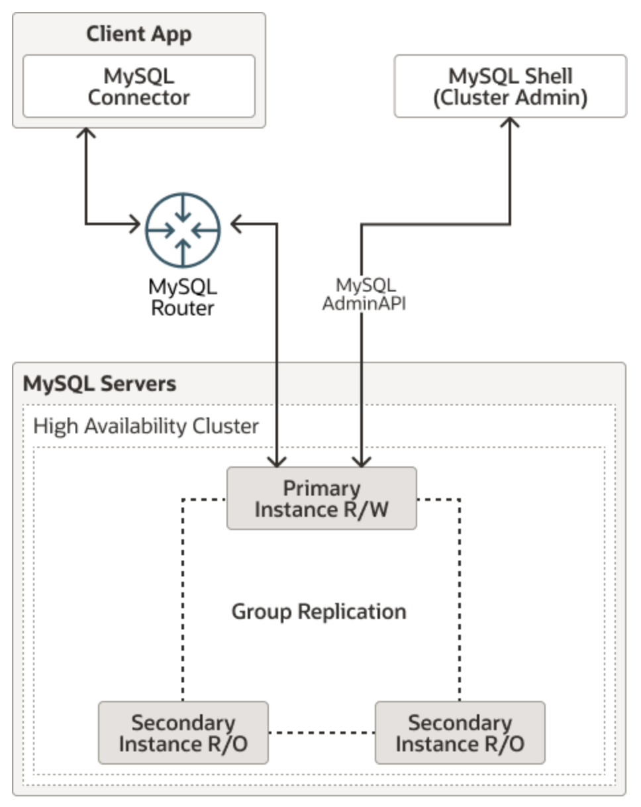
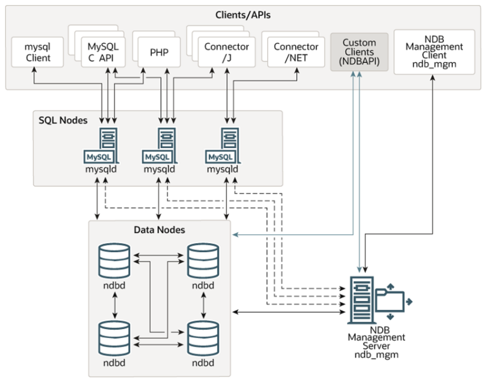

# MySQL Cluster & Replication

## Cluster

### What is MySQL Cluster

- **MySQL Server**: This is the primary software that handles client connections and threads, parses, and optimizes queries. Typically, it runs as a _single process_ on a _single machine_.

- **Deficiency in High Availability**: For applications requiring high availability — such as telecom, web services, and financial services — a single running MySQL server is not sufficient.

  - For example, if a bank's database server goes down, it could disrupt all transactions, causing significant issues for customers and the bank itself. Therefore, it's essential to have a redundant infrastructure that can quickly become accessible to the application in case of failure.

- **MySQL Cluster**: MySQL Cluster addresses this issue by utilizing a _distributed architecture_, making it more suitable for large-scale and high-concurrency application scenarios compared to a traditional MySQL server.
  - In a MySQL Cluster, multiple nodes work together to ensure the database is always available and can handle a high volume of transactions simultaneously.

### Two Types of MySQL Cluster

#### InnoDB Cluster

##### Overview

- An InnoDB Cluster consists of at least three MySQL Server instances, and it offers built-in automatic failover and recovery capabilities.
  

##### Components

1. **MySQL Shell**: A command-line tool for easily configuring and administering a group of at least three MySQL server instances to function as an InnoDB Cluster.

2. **MySQL Server Instances**: Each MySQL server instance in an InnoDB Cluster runs MySQL Group Replication, which provides the mechanism to replicate data within an InnoDB Cluster, with _built-in failover_.

3. **Group Replication**: Ensures data consistency and fault tolerance by replicating data across multiple instances.

4. **MySQL Router**: Directs traffic to the correct server, providing load balancing and transparent failover.

#### NDB Cluster

##### Overview

- NDB Cluster is a technology that enables clustering of in-memory databases in a _shared-nothing system_.

  - The shared-nothing architecture enables the system to work with very inexpensive hardware, and with a minimum of specific requirements for hardware or software.

- An NDB Cluster consists of a set of computers, known as _hosts_, each running one or more processes. These processes are known as _nodes_.
  

##### Components

1. **SQL Nodes**: Provide the SQL interface for clients to interact with the cluster.

   - In the case of NDB Cluster, an SQL node is a traditional MySQL server that uses the `NDBCLUSTER` storage engine.

2. **Management Nodes**: Manage the configuration and monitoring the other nodes within the NDB Cluster.

   - E.g., providing configuration data, starting and stopping nodes, and running backups.

3. **Data Nodes**: Store the actual data and handle data processing.

#### Comparison & Use Cases

|                  | InnoDB Cluster                                                                                                                                      | NDB Cluster                                                                                                                                                                                       |
| ---------------- | --------------------------------------------------------------------------------------------------------------------------------------------------- | ------------------------------------------------------------------------------------------------------------------------------------------------------------------------------------------------- |
| **🤗 Pros**      | - Easy to set up and manage using MySQL Shell. - Provides automatic failover and recovery. - Uses the familiar InnoDB storage engine.         | - High performance with low latency, optimized for real-time applications. - Highly scalable, capable of handling large numbers of nodes. - Robust fault tolerance with automatic failover. |
| **🤧 Cons**      | - May introduce some latency due to Group Replication. - Typically scales to a smaller number of nodes compared to NDB Cluster.                  | - More complex to set up and manage. - Requires more hardware resources.                                                                                                                       |
| **🪝 Use Cases** | - Web applications needing high availability and strong transactional support. - E-commerce sites that require robust data integrity and uptime. | - Telecom systems processing real-time data. - Financial services requiring low-latency transactions. - Large-scale web services needing high throughput.                                   |

## Replication
