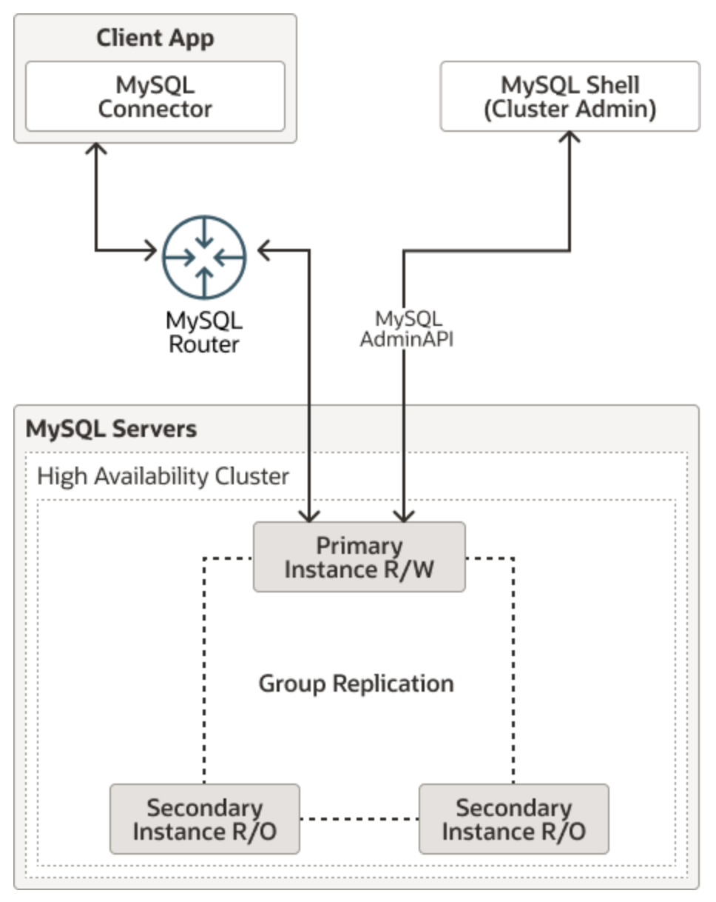
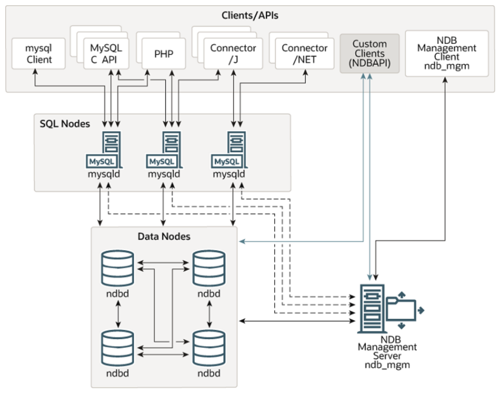
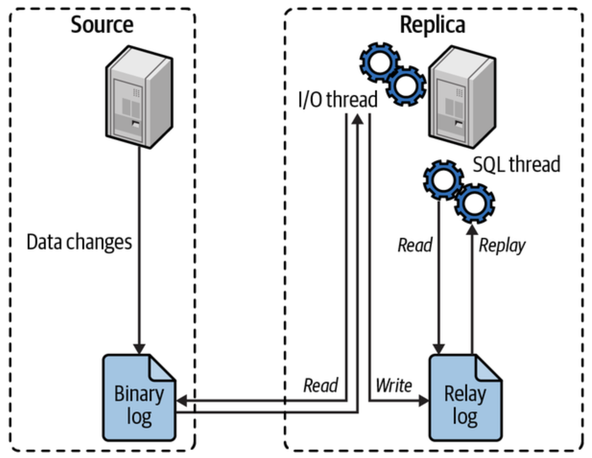
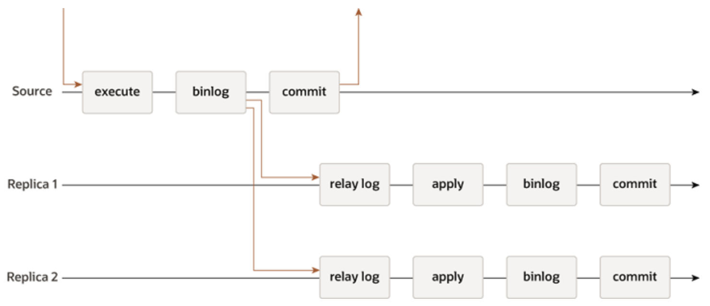
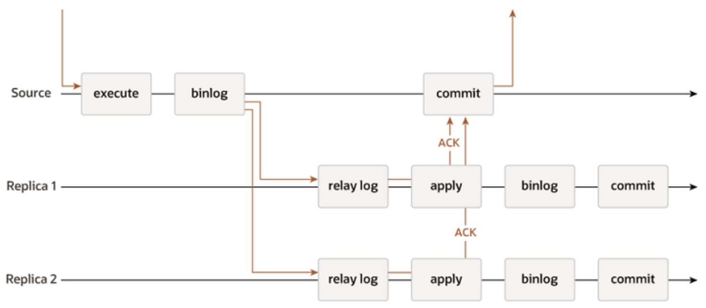
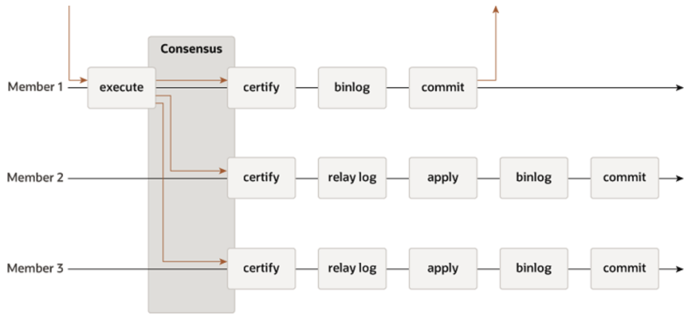

# MySQL Cluster & Replication

## Cluster

### What is MySQL Cluster

- **MySQL Server**: This is the primary software that handles client connections and threads, parses, and optimizes queries. Typically, it runs as a _single process_ on a _single machine_.

- **Deficiency in High Availability**: For applications requiring high availability — such as telecom, web services, and financial services — a single running MySQL server is not sufficient.

  - For example, if a bank's database server goes down, it could disrupt all transactions, causing significant issues for customers and the bank itself. Therefore, it's essential to have a redundant infrastructure that can quickly become accessible to the application in case of failure.

- **MySQL Cluster**: MySQL Cluster addresses this issue by utilizing a _distributed architecture_, making it more suitable for large-scale and high-concurrency application scenarios compared to a traditional MySQL server.
  - In a MySQL Cluster, multiple nodes work together to ensure the database is always available and can handle a high volume of transactions simultaneously.

### Two Types of MySQL Cluster

#### InnoDB Cluster

##### Overview

- An InnoDB Cluster consists of at least three MySQL Server instances, and it offers built-in automatic failover and recovery capabilities.
  

##### Components

1. **MySQL Shell**: A command-line tool for easily configuring and administering a group of at least three MySQL server instances to function as an InnoDB Cluster.

2. **MySQL Server Instances**: Each MySQL server instance in an InnoDB Cluster runs MySQL Group Replication, which provides the mechanism to replicate data within an InnoDB Cluster, with _built-in failover_.

3. **Group Replication**: Ensures data consistency and fault tolerance by replicating data across multiple instances.

4. **MySQL Router**: Directs traffic to the correct server, providing load balancing and transparent failover.

#### NDB Cluster

##### Overview

- NDB Cluster is a technology that enables clustering of in-memory databases in a _shared-nothing system_.

  - The shared-nothing architecture enables the system to work with very inexpensive hardware, and with a minimum of specific requirements for hardware or software.

- An NDB Cluster consists of a set of computers, known as _hosts_, each running one or more processes. These processes are known as _nodes_.
  

##### Components

1. **SQL Nodes**: Provide the SQL interface for clients to interact with the cluster.

   - In the case of NDB Cluster, an SQL node is a traditional MySQL server that uses the `NDBCLUSTER` storage engine.

2. **Management Nodes**: Manage the configuration and monitoring the other nodes within the NDB Cluster.

   - E.g., providing configuration data, starting and stopping nodes, and running backups.

3. **Data Nodes**: Store the actual data and handle data processing.

#### Comparison & Use Cases

|                  | InnoDB Cluster                                                                                                                                      | NDB Cluster                                                                                                                                                                                       |
| ---------------- | --------------------------------------------------------------------------------------------------------------------------------------------------- | ------------------------------------------------------------------------------------------------------------------------------------------------------------------------------------------------- |
| **🤗 Pros**      | - Easy to set up and manage using MySQL Shell.<br>- Provides automatic failover and recovery.<br>- Uses the familiar InnoDB storage engine.         | - High performance with low latency, optimized for real-time applications.<br>- Highly scalable, capable of handling large numbers of nodes.<br>- Robust fault tolerance with automatic failover. |
| **🤧 Cons**      | - May introduce some latency due to Group Replication.<br>- Typically scales to a smaller number of nodes compared to NDB Cluster.                  | - More complex to set up and manage.<br>- Requires more hardware resources.                                                                                                                       |
| **🪝 Use Cases** | - Web applications needing high availability and strong transactional support.<br>- E-commerce sites that require robust data integrity and uptime. | - Telecom systems processing real-time data.<br>- Financial services requiring low-latency transactions.<br>- Large-scale web services needing high throughput.                                   |

## Replication

### Overview

- **Problem**: Among database instances in the cluster, how do we keep data synchronized within the same topology?
- **Solution**: Replication, which involves writing events that modify data or data structure to a log on a source server. Replica servers can then read the events from the log on the source and replay them. This is generally an asynchronous process. At a high level, replication is a simple three-part process:
  1. **Binary Log on Source**: The source records changes to its data in its binary log as “binary log events.”
  2. **Relay Log on Replica**: The replica copies the source’s binary log events to its own local relay log.
  3. **Replaying Events on Replica**: The replica replays the events in the relay log, applying the changes to its own data.
     

### Replication Under the Hood

#### Binary Log Formats

1. **Statement-based replication**: Record the query that changed the data on the source.

   - 🟢 Simple and compact.
   - 🔴 Has problems with nondeterministic queries.

2. **Row-based replication**: Write events to the binary log that indicate how the row has changed.

   - 🟢 Deterministic, provides the safest method of replicating data.
   - 🔴 Writing the events for row data changes for every row affected can increase the size of the binary log dramatically.

3. **Mixed method**: Use statement-based format as the default and only switching to row-based when it needs to.

#### Global Transaction Identifiers

- **Problem**: If the source has crashed and you had to rebuild the data from a backup, how could you reattach your replica if the binary logs started over again?
- **Solution**: Global transaction identifiers (GTIDs) for tracking replication positions.
  - With GTIDs, every transaction that a source server commits is assigned a unique identifier.

### Types of Replication

- Traditional MySQL Replication provides a simple source to replica approach to replication. The source is the primary, and there are one or more replicas, which are secondaries. The source applies transactions, commits them and then they are later (thus asynchronously) sent to the replicas to be either re-executed (in statement-based replication) or applied (in row-based replication). It is a **shared-nothing system**, where all servers have a full copy of the data by default.

#### Asynchronous Replication

- The source server _does not wait_ for replicas to confirm receipt of data before committing the transaction. This means there could be a slight delay (lag) between when data is updated on the source and when it is updated on the replicas.
- **Pros**: Higher performance and lower latency for the source server because it does not have to wait for replicas.
- **Cons**: There is a risk of data loss if the source server fails before the data is replicated.
  

#### Semisynchronous Replication

- Every transaction that source commits must be acknowledged as received by _at least_ one replica.
  - The acknowledgment confirms that the replica received it and successfully wrote it to its own relay log (but not necessarily applied it to the local data).
  - If no replicas acknowledge the transaction during the time frame, MySQL reverts to its standard asynchronous replication.
- Since each transaction must wait on the response from other nodes, this feature adds additional latency to every transaction that the server does.
- **Use Case**: In the event of a network partition, an isolated source isn’t still writing data while partitioned from its replicas.
  

#### Synchronous Replication

- The source server waits for _all replicas_ to confirm receipt of data before committing the transaction. This ensures that data is consistent across all replicas at all times.
- **Pros**: Strong consistency, as all replicas are guaranteed to have the same data as the source.
- **Cons**: Can introduce latency because the source must wait for acknowledgments from all replicas.

#### Group Replication

- The replication group is a set of servers that each have their own entire copy of the data (a shared-nothing replication scheme), and interact with each other through message passing.
- Each server in the group may execute transactions independently at any time.
- However, all read-write transactions commit only after they have been approved by the group.
  - In other words, for any read-write transaction the group needs to decide whether it commits or not, so the commit operation is not a unilateral decision from the originating server.
  - Read-only transactions need no coordination within the group and commit immediately.
- **Certification**: Detect conflicts between transactions that execute concurrently on different servers.
  - Conflict detection is carried out at row level: If two concurrent transactions, that executed on different servers, update the same row, then there is a conflict.
  - Distributed first commit wins: The conflict resolution procedure states that the transaction that was ordered first commits on all servers, and the transaction ordered second aborts, and is therefore rolled back on the originating server and dropped by the other servers in the group.
    

### Recommended Replication Topologies

#### Active/Passive

- Direct all reads and writes to a single source server.
- Maintain a small number of passive replicas that do not actively serve any application traffic.
- **Use Case**: Don’t want to worry about replication lag.
  - Since all reads go to the source, prevent any read-after-write problems that an application may not tolerate.
- **Caveats**: Explicitly binding read scaling to the capacity of a single server.

#### Active/Read Pool

- Direct all writes to the source. Reads can be sent to either the source server or the read pool.
- **Use Case**: A read pool allows to scale reads horizontally for read-intensive applications.
- **Caveats**: Application must have some tolerance for stale reads. You will never be able to guarantee that a write you complete on the source has already been replicated to a replica.

## Hands-on: Create A MySQL Cluster with One Source Server & Two Replica Servers

### Step 1: Set Up MySQL Cluster

#### 1.1 Install MySQL

- On Mac, use Homebrew to install MySQL

```bash
brew install mysql
```

- For other systems, refer to the installation guide [here](https://dev.mysql.com/doc/refman/8.4/en/installing.html)

#### 1.2 Start MySQL Service

```bash
brew services start mysql
```

#### 1.3 Create a New User (Optional)

- Log into MySQL

```bash
mysql -u root
```

- Create a new user

```sql
CREATE USER 'username'@'localhost' IDENTIFIED BY 'user_password';
GRANT ALL PRIVILEGES ON *.* TO 'username'@'localhost' WITH GRANT OPTION;
FLUSH PRIVILEGES;
```

- Exit MySQL

```bash
exit;
```

#### 1.4 Restart MySQL Service

```bash
brew services start mysql
```

#### 1.5 Connect to MySQL with New User

- Now you should be able to access MySQL with the new user or the root user using the password you set in 1.3.

```bash
mysql -u username -p
```

## Step 2: Configure the Source Server

### 2.1 Create Database (Optional)

```bash
mysql -u username -p
CREATE DATABASE your_database_name;
exit;
```

- To check if the database has successfully been created or not, run the following command:

```sql
SHOW DATABASES;
```

### 2.2 Enable Binary Logging on Source Server

- The default config file for MySQL installed via Homebrew is located at `/opt/homebrew/etc/my.cnf`. Open the file in your favorite editor and modify the parameters as needed:

```bash
sudo vim /opt/homebrew/etc/my.cnf
```

> The config file has sections specified by `section_name`. All the parameters related to a section can be put under them, for example:
>
> ```bash
> # [mysql]: Section is read by the mysql command-line client
> # [mysqld]: Section is read by the mysql server
> [mysqld] <---section name
> <parameter_name> = <value> <---parameter values
> # [client]: Section is read by all connecting clients (including mysql cli)
> [client]
> <parameter_name> = <value>
> # [mysqldump]: The section is read by the backup utility called mysqldump
> [mysqldump]
> <parameter_name> = <value>
> # [mysqld_safe]: Read by the mysqld_safe process (MySQL Server Startup Script)
> [mysqld_safe]
> <parameter_name> = <value>
> [server]
> <parameter_name> = <value>
> ```

- To enable binlog, you have to set `log_bin` and `server_id` and restart the server.

```bash
[mysqld]
server-id = 1
log_bin = /opt/homebrew/var/mysql/source-binlog
binlog_do_db = cluster_db_test
```

### 2.3 Restart the MySQL Service

- Restart the MySQL service to apply the new configuration

```bash
brew services restart mysql
```

### 2.4 Verify Binary Logs Creation

```bash
mysql -u username -p
```

```sql
SHOW VARIABLES LIKE 'log_bin%';
```

- Output should look like this:

```
+---------------------------------+---------------------------------------------+
| Variable_name                   | Value                                       |
+---------------------------------+---------------------------------------------+
| log_bin                         | ON                                          |
| log_bin_basename                | /opt/homebrew/var/mysql/source-binlog       |
| log_bin_index                   | /opt/homebrew/var/mysql/source-binlog.index |
| log_bin_trust_function_creators | OFF                                         |
+---------------------------------+---------------------------------------------+
4 rows in set (0.02 sec)
```

### 2.5 Create a Replication User

- The replicas connect to the source using this account

```bash
mysql -u username -p
```

```sql
CREATE USER 'replica_user'@'%' IDENTIFIED BY 'replica_password';
GRANT REPLICATION SLAVE ON *.* TO 'replica_user'@'%';
FLUSH PRIVILEGES;
```

### 2.6 Flush Tables & Acquire Global Read Lock

```sql
FLUSH TABLES WITH READ LOCK;
```

### 2.7 Check the Source Server Status

```sql
SHOW MASTER STATUS;
```

## Step 3: Configure the Replica Servers

### 3.1 Create Separate Data Directories

- Since I am running multiple MySQL instances on the same machine, I need to create separate configuration files, data directories, and start each instance with its own configuration.

```bash
mkdir -p /opt/homebrew/var/mysql1
mkdir -p /opt/homebrew/var/mysql2
```

### 3.2 Create Separate Configuration Files

#### 3.2.1 Configuration for Replica 1

```bash
sudo vim /opt/homebrew/etc/my1.cnf
```

```bash
[mysqld]
server-id = 2
port = 3307
datadir = /opt/homebrew/var/mysql1
socket = /tmp/mysql1.sock
log_bin = /opt/homebrew/var/mysql1/source-binlog
relay-log = /opt/homebrew/var/mysql1/replica1-binlog
pid-file = /opt/homebrew/var/mysql1/mysql.pid
```

#### 3.2.2 Configuration for Replica 2

```bash
sudo vim /opt/homebrew/etc/my2.cnf
```

```bash
[mysqld]
server-id = 3
port = 3308
datadir = /opt/homebrew/var/mysql2
socket = /tmp/mysql2.sock
log_bin = /opt/homebrew/var/mysql2/source-binlog
relay-log = /opt/homebrew/var/mysql2/replica2-binlog
pid-file = /opt/homebrew/var/mysql2/mysql.pid
```

### 3.3 Initialize Data Directories

```bash
mysqld --initialize --datadir=/opt/homebrew/var/mysql1 --user=$(whoami)
mysqld --initialize --datadir=/opt/homebrew/var/mysql2 --user=$(whoami)
```

### 3.4 Start Each Replica Instance

```bash
mysqld_safe --defaults-file=/opt/homebrew/etc/my1.cnf --skip-grant-tables &
mysqld_safe --defaults-file=/opt/homebrew/etc/my2.cnf --skip-grant-tables &
```

## Step 4: Configure Replication on Each Replica

### 4.1 Log into the MySQL Server on Replica

```bash
mysql --socket=/tmp/mysql1.sock
```

### 4.2 Configure the Replica to Start Replication

```sql
CHANGE MASTER TO
    MASTER_HOST='192.168.1.105',
    MASTER_USER='replica',
    MASTER_PASSWORD='replica',
    MASTER_LOG_FILE='source-binlog.000004',
    MASTER_LOG_POS=158;
START SLAVE;
```

- Run the following command to get the `binary log file name` and `position`:

```bash
brew services start mysql
mysql -u username -p
```

```sql
SHOW MASTER STATUS;
```

```
+----------------------+----------+-----------------+------------------+-------------------+
| File                 | Position | Binlog_Do_DB    | Binlog_Ignore_DB | Executed_Gtid_Set |
+----------------------+----------+-----------------+------------------+-------------------+
| source-binlog.000004 |      158 | cluster_db_test |                  |                   |
+----------------------+----------+-----------------+------------------+-------------------+
```

### 4.3 Verify the Replication Status

```sql
SHOW SLAVE STATUS\G
```

- Ensure that the `Slave_IO_Running` and `Slave_SQL_Running` fields are both **Yes**

```sql
mysql> SHOW SLAVE STATUS\G
*************************** 1. row ***************************
               Slave_IO_State: Waiting for source to send event
                  Master_Host: 192.168.1.105
                  Master_User: replica
                  Master_Port: 3306
                Connect_Retry: 60
              Master_Log_File: source-binlog.000005
          Read_Master_Log_Pos: 158
               Relay_Log_File: replica1-binlog.000005
                Relay_Log_Pos: 383
        Relay_Master_Log_File: source-binlog.000005
             Slave_IO_Running: Yes
            Slave_SQL_Running: Yes
              Replicate_Do_DB:
          Replicate_Ignore_DB:
           Replicate_Do_Table:
       Replicate_Ignore_Table:
      Replicate_Wild_Do_Table:
  Replicate_Wild_Ignore_Table:
                   Last_Errno: 0
                   Last_Error:
                 Skip_Counter: 0
          Exec_Master_Log_Pos: 158
              Relay_Log_Space: 768
              Until_Condition: None
               Until_Log_File:
                Until_Log_Pos: 0
           Master_SSL_Allowed: No
           Master_SSL_CA_File:
           Master_SSL_CA_Path:
              Master_SSL_Cert:
            Master_SSL_Cipher:
               Master_SSL_Key:
        Seconds_Behind_Master: 0
Master_SSL_Verify_Server_Cert: No
                Last_IO_Errno: 0
                Last_IO_Error:
               Last_SQL_Errno: 0
               Last_SQL_Error:
  Replicate_Ignore_Server_Ids:
             Master_Server_Id: 1
                  Master_UUID: f042386a-242e-11ef-8309-6255818a3157
             Master_Info_File: mysql.slave_master_info
                    SQL_Delay: 0
          SQL_Remaining_Delay: NULL
      Slave_SQL_Running_State: Replica has read all relay log; waiting for more updates
           Master_Retry_Count: 10
                  Master_Bind:
      Last_IO_Error_Timestamp:
     Last_SQL_Error_Timestamp:
               Master_SSL_Crl:
           Master_SSL_Crlpath:
           Retrieved_Gtid_Set:
            Executed_Gtid_Set:
                Auto_Position: 0
         Replicate_Rewrite_DB:
                 Channel_Name:
           Master_TLS_Version:
       Master_public_key_path:
        Get_master_public_key: 0
            Network_Namespace:
1 row in set, 1 warning (0.00 sec)
```

### 4.4 Repeat the Same Steps for Replica 2

```sql
mysql> SHOW SLAVE STATUS\G
*************************** 1. row ***************************
               Slave_IO_State: Waiting for source to send event
                  Master_Host: 192.168.1.105
                  Master_User: replica
                  Master_Port: 3306
                Connect_Retry: 60
              Master_Log_File: source-binlog.000005
          Read_Master_Log_Pos: 158
               Relay_Log_File: replica2-binlog.000003
                Relay_Log_Pos: 383
        Relay_Master_Log_File: source-binlog.000005
             Slave_IO_Running: Yes
            Slave_SQL_Running: Yes
              Replicate_Do_DB:
          Replicate_Ignore_DB:
           Replicate_Do_Table:
       Replicate_Ignore_Table:
      Replicate_Wild_Do_Table:
  Replicate_Wild_Ignore_Table:
                   Last_Errno: 0
                   Last_Error:
                 Skip_Counter: 0
          Exec_Master_Log_Pos: 158
              Relay_Log_Space: 768
              Until_Condition: None
               Until_Log_File:
                Until_Log_Pos: 0
           Master_SSL_Allowed: No
           Master_SSL_CA_File:
           Master_SSL_CA_Path:
              Master_SSL_Cert:
            Master_SSL_Cipher:
               Master_SSL_Key:
        Seconds_Behind_Master: 0
Master_SSL_Verify_Server_Cert: No
                Last_IO_Errno: 0
                Last_IO_Error:
               Last_SQL_Errno: 0
               Last_SQL_Error:
  Replicate_Ignore_Server_Ids:
             Master_Server_Id: 1
                  Master_UUID: f042386a-242e-11ef-8309-6255818a3157
             Master_Info_File: mysql.slave_master_info
                    SQL_Delay: 0
          SQL_Remaining_Delay: NULL
      Slave_SQL_Running_State: Replica has read all relay log; waiting for more updates
           Master_Retry_Count: 10
                  Master_Bind:
      Last_IO_Error_Timestamp:
     Last_SQL_Error_Timestamp:
               Master_SSL_Crl:
           Master_SSL_Crlpath:
           Retrieved_Gtid_Set:
            Executed_Gtid_Set:
                Auto_Position: 0
         Replicate_Rewrite_DB:
                 Channel_Name:
           Master_TLS_Version:
       Master_public_key_path:
        Get_master_public_key: 0
            Network_Namespace:
1 row in set, 1 warning (0.01 sec)
```
